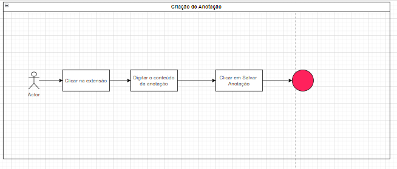
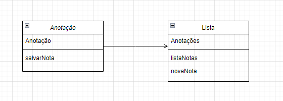

# AnotaFacil_ChromeExtension
## Extensão do Google Chrome para trabalho de Engenharia e Projeto de Software

O sistema é composto por uma caixa de texto feita em CSS  e HTML, que recebe dados do usuário e os salva na própria tela através de um arquivo Javascript, criando uma lista que fica suspensa na tela abaixo do campo de inserção de dados.

A essência do código está na ação de gravar e incluir na lista, conforme abaixo:

´´´
document.getElementById('salvarNota').addEventListener('click', function() {
    const notaInput = document.getElementById('notaInput');
    const notaTexto = notaInput.value.trim();

    if (notaTexto) {
        const listaNotas = document.getElementById('listaNotas');
        const novaNota = document.createElement('li');
        novaNota.textContent = notaTexto;
        listaNotas.appendChild(novaNota); // Insere na lista
        
        notaInput.value = ''; // Limpa o campo de texto
    } else {
        // Campo sem texto, retorna erro
        alert('Anotação sem conteúdo. Por favor, faça uma anotação para que ela seja salva!');
    }
});
´´´

## Diagrama de Caso de uso:
https://github.com/Guism92/AnotaFacil_ChromeExtension/blob/main/DiagramaCasoUso.drawio

## Diagrama de Classes:
https://github.com/Guism92/AnotaFacil_ChromeExtension/blob/main/DiagramaClasses.drawio

